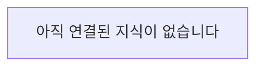

# my-dev-wiki

개발 공부와 문제 해결 과정에서 **내가 실제로 이해한 것**을 장기적으로 보존하고 다시 꺼내 쓰기 위한 개인 지식 저장소입니다.

이 저장소는 자료 수집용 아카이브나 AI가 만든 백과사전이 아닙니다. 핵심 입력은 대화, 공부, 프로젝트 과정에서 형성된 사용자의 이해입니다.

## Knowledge Graph

아래 그래프는 각 지식 문서의 `Connections`를 기반으로 에이전트가 갱신하는 **파생 뷰**입니다.

- 실제 지식과 관계의 원본은 `knowledge/` 안의 문서입니다.
- 그래프를 직접 관리하지 않습니다.
- `Connections`가 추가되거나 변경되면 그래프도 함께 갱신합니다.

## Structure

- `AGENTS.md` — 모든 에이전트가 항상 지켜야 할 핵심 원칙
- `INDEX.md` — 지식 탐색의 시작점
- `knowledge/` — 실제 개발 지식. 지식이 생긴 domain만 필요할 때 생성
- `.agent/store.md` — 지식 저장 workflow
- `.agent/recall.md` — 기억 회상 workflow
- `.agent/review.md` — 복습 workflow
- `_system/knowledge-template.md` — 지식 문서 기본 양식

## Main idea

> 자료를 저장하기보다, 자료를 통해 형성된 나의 이해를 저장한다.

저장량보다 **회상, 복습, 현재 작업과의 연결**을 우선합니다.
